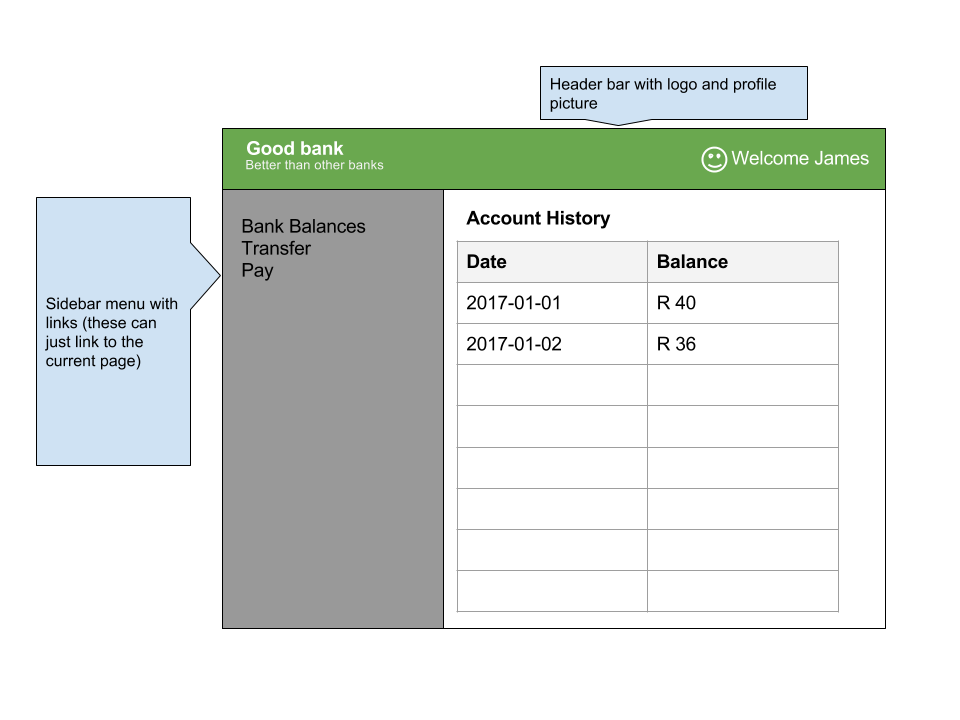

Flask-Task
==========

This is a pre-interview task for the position of **junior front-end and integration engineer** at BusinessOptics.

The goal of these tasks is to build a very simple banking app that displays your bank balance over time, allows you to update it, and then also shows the equivalent bitcoin value. It is broken up into 5 stages. Once you have completed each stage. Store it in the folder named "stage-X", then create a copy and move on.

This is a simple task and should not take you too long to do. We are interested in the clarity and simplicity of your code. Please include a README on how to run this, a requirements.txt file would be nice to. At a minimum this expects that you can get the python components completed, if you are not comfortable with the javascript sections you submit in a any case.

Fork this repository and when completed send a message to "jobs@businessoptics.biz" with the relevant github repo address.

### (1)
Create a simple flask application (http://flask.pocoo.org/) with a page that displays your bank balance over time. You can make up or simulate the data. At a minimum the page should show a table two columns:
  * Date
  * Balance (in ZAR)

### (2)
Change the layout and style your page using CSS. The layout should look something like this.

The mockup is just a suggestion, you can choose your own colours etc. Try to make it look clean and attractive. We are not looking for ground breaking design, just a demonstration of knowledge. Don't worry about cross browser compatibility, assume a reasonably modern browser. Bonus points for making the layout responsive and work on mobile devices.

### (3)
Add a form below the table that allows you set your current balance. When submitted this should store the balance using the session (http://flask.pocoo.org/docs/0.12/quickstart/#sessions) and then when the table is rendered again it should appear at the end of the table. Submitting multiple times should append and grow the list.

### (4)
Use the LUNO API to find the current price in bitcoin and display the bitcoin value of each balance entry in a new column. This is obviously only teh present day value but this is a toy example, so don't worry.

Use the requests library (http://docs.python-requests.org/en/master/) to do the API call. The endpoint you need to hit is "https://api.mybitx.com/api/1/ticker?pair=XBTZAR", you can get documentation here (https://www.luno.com/en/api#market-ticker). 

### (5)
Now instead of doing a page reload to add a new balance, use Javascript to do an asynchronous request. This should save the result to the server and adds a new row to the balances table. You may use any javascript library or framework you want (but don't go over board, this should be simple, probably use jquery). I suggest you create a single new endpoint "api/update" that take a Rand figure and returns the full balance history until now, and then you re-render the balance table.
